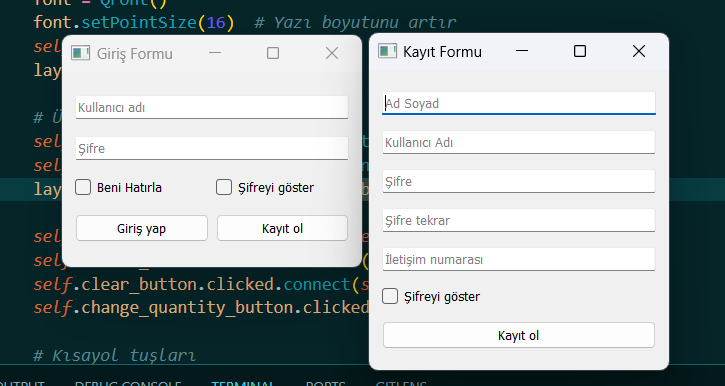
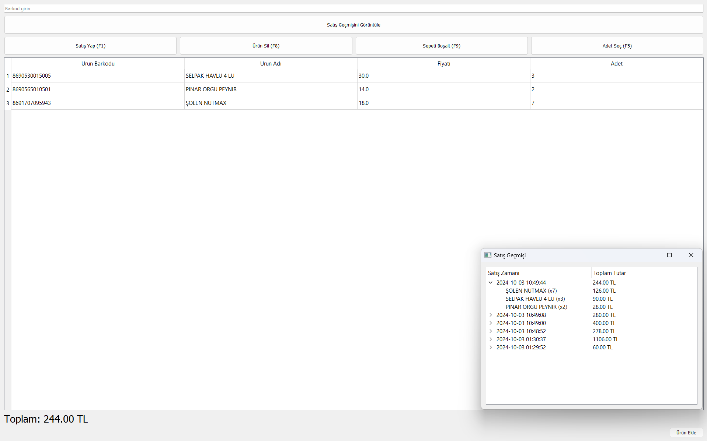

## İşlevsellik
| İşlev                                                          | Mevcut mu? |
|----------------------------------------------------------------|:----------:|
| Ürün Ekleme                                                    |     ✅     |
| Kayıt Olma                                                     |     ✅     |
| Sepet kontrolü (Ürün ekleme, çıkarma, adet değiştirme)         |     ✅     |
| Geçmiş siparişleri görüntüleme                                 |     ✅     |
| Ürün Fiyatı Güncelleme                                         |     🔜     |
| Ürün Stoğu Düzenleme                                           |     🔜     |
| Net Kâr ve Ciro Hesaplama                                      |     🔜     |
| Veresiye defteri                                               |     🔜     |
| Ürünleri Bulut Yedeği Alma                                     |     🔜     |
| Görsel Güzelleştirmeler/Animasyon Efektleri                    |     🔜     |
| Ürün Listesi Dışarı Aktarma                                    |     🔜     |
| Ürün Listesi İçeri Aktarma                                     |     🔜     |
| Otomatik Bulut Yedeği                                          |     🔜     |
| Verileri Bulut Yedeğinden Geri Yükleme                         |     🔜     |

## Kurulum 📚
1. `INSTALL.bat` dosyasını çalıştırarak gerekli kütüphaneleri indirin.
2. `MySQL.sql` scriptini çalıştırın.
3. `/PhpCodes/login.php` ve `/PhpCodes/register.php` kodlarını sunucunuza ekleyin, `/PhpCodes/config.php` dosyasında gerekli düzenlemeleri gerçekleştirin.
4. `main.py` dosyasını açarak uygulamayı çalıştırın.

## Önkoşullar
Başlamadan önce aşağıdakilerin kurulu olduğundan emin olun:
- [Python](https://www.python.org/downloads/) sürüm 3.10 veya 3.11
